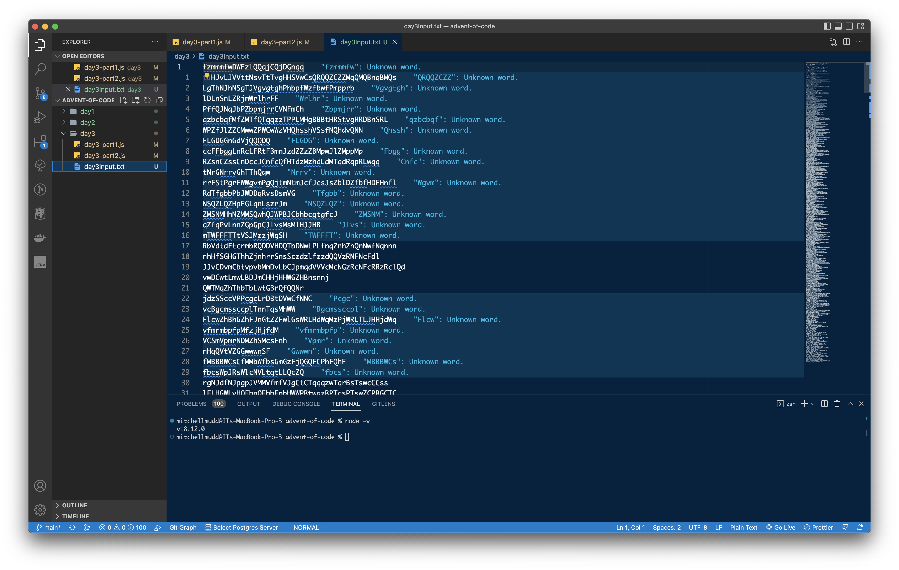
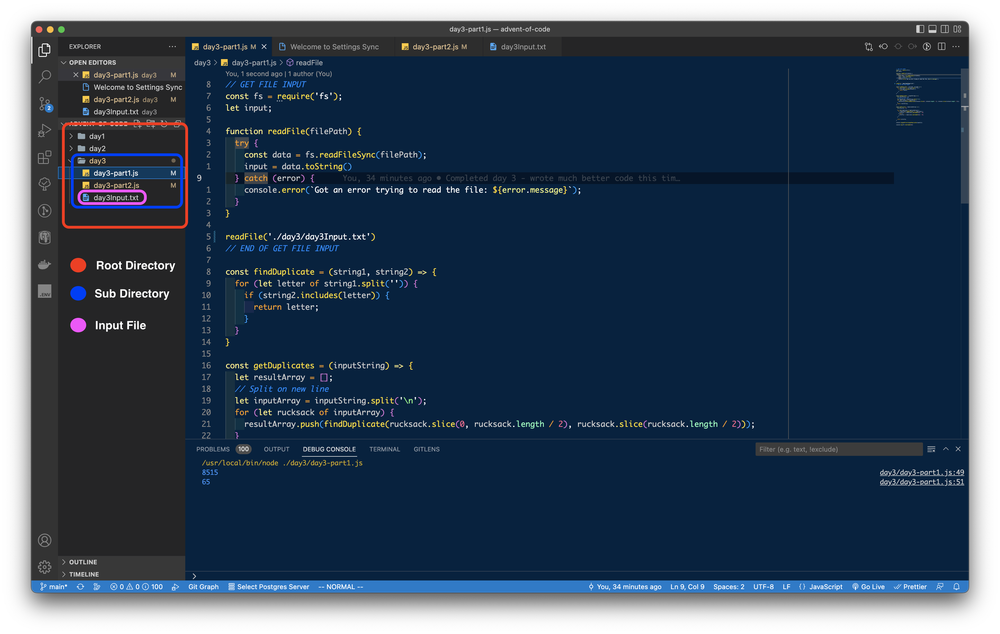

Advent of code is a coding challenge that happens every year in December. This is my first year taking part and I found it a bit clunky to copy and paste the input into a string within my JavaScript file. 

The solution: use the Node File System module in synchronous mode 🙂 Using *fs.readFileSync* may not be best practice on normal project (you’re blocking the program from moving until the file is processed), but for advent of code it’s really nice to **simply get your input**. 

<!--truncate-->

You’ll need Node for the code below to work. I’ve linked tutorials for Mac and Linux on how to install Node. For Windows I’ve linked the download page of NodeJS.

Without further ado let’s read some text files! 🤓🗂

## Installing Node

### Mac
[https://www.digitalocean.com/community/tutorials/how-to-install-node-js-and-create-a-local-development-environment-on-macos](https://www.digitalocean.com/community/tutorials/how-to-install-node-js-and-create-a-local-development-environment-on-macos)

### Ubuntu Linux
[https://www.digitalocean.com/community/tutorials/how-to-install-node-js-on-ubuntu-18-04](https://www.digitalocean.com/community/tutorials/how-to-install-node-js-on-ubuntu-18-04)

### Windows
[https://nodejs.dev/en/download/](https://nodejs.dev/en/download/)

## STEP 1: Create .txt file

Place the input.txt file into the directory you plan on working out of 



## STEP 2: Import Node File System Module

Import the fs module from Node as shown using the Ecmascript Module Syntax

```jsx
const fs = require('fs');
```

## STEP 3: Create a function to read your text files

```jsx
function readFile(filePath) {
  try {
    const data = fs.readFileSync(filePath);
    return data.toString();
  } catch (error) {
    console.error(`Got an error trying to read the file: ${error.message}`);
  }
}
```

## STEP 4: Call your function

Call the function and store the input in a variable 

```jsx
const adventOfCodeInput = readFile('./day3/day3Input.txt');
// When working with this I HAD to had to specify the file path as shown above
// ./subdirectory/file where ./ is actually the very root of the directory

// FIRST 17 LINES OF OUTPUT
console.log(adventOfCodeInput)
`fzmmmfwDWFzlQQqjCQjDGnqq
tJHJvLJVVttNsvTtTvgHHSVwCsQRQQZCZZMqQMQBnqBMQs
rpFtPrzrMFZvZTLPpglhdssFshssJhsggG
pTtLtBMjZLfHvNWqcBHf
PZnSjnnsVfjfLLff
crvccpglrtHfNbzbHLzmGN
lptTLFFpdgvttFWltTclplDvhJMSMPhJPhChShPBZBMJhPMT
mPSPdnhznPdhSmPGchJdFDtBhghgFgWpFBQhTBMg
rHNNvbqHHHwZwMGMWtgtQMZQFQ
wRqqRffvvNHwrHqrNqLvCrqvmPnzdsGJsSsSdSsLPVVPnjsn
CzlngWpClJlzRJpDnpmzCndrhBcrhwcsBcLsNcsmLdQQ
qqSjqFGTFbPFSPTVjcBcBsDdQrwBVLrNcc
PtDDtZTvGDvFCMzZlRJCfWfJ
vtQDpvpvVvvcSFrrljZZsVjFrV
RqcTTRddRrlsjZrwrT
zmbdRdMmMgbPDcGhGmnDpcQn
gZqJRZRZdltFVGZQDZwV
`
```

**Now you can solve your advent of code problem! 🙂**

### NOTE/WARNING

<aside>
📝 The file path was a bit wonky for me when I nested my txt file in a folder along with my code. The comments explain how I fixed it and the picture below the code shows the file structure visually.

</aside>




**Good luck with Advent of Code if you’re participating!** 


## Final Code

```jsx
// GET FILE INPUT
const fs = require('fs');

function readFile(filePath) {
  try {
    const data = fs.readFileSync(filePath);
    return data.toString();
  } catch (error) {
    console.error(`Got an error trying to read the file: ${error.message}`);
  }
}

const adventOfCodeInput = readFile('./day3/day3Input.txt');
// END OF GET FILE INPUT
```

#### Attributions
Tree Background Image: Photo by <a href="https://unsplash.com/@premroshan?utm_source=unsplash&utm_medium=referral&utm_content=creditCopyText">Prem Roshan</a> on <a href="https://unsplash.com/s/photos/christmas?utm_source=unsplash&utm_medium=referral&utm_content=creditCopyText">Unsplash</a>

NodeJS Icon: <a href="https://freebiesupply.com/logos/nodejs-icon-logo/">Freebie Supply</a>

Squiggly Line: <a href="https://thenounproject.com/icon/squiggly-line-2615729/">Icon by 'Made by made' on The Noun Project</a>

