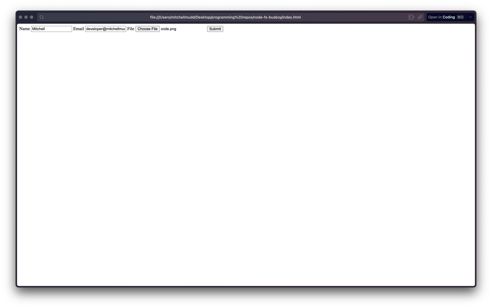
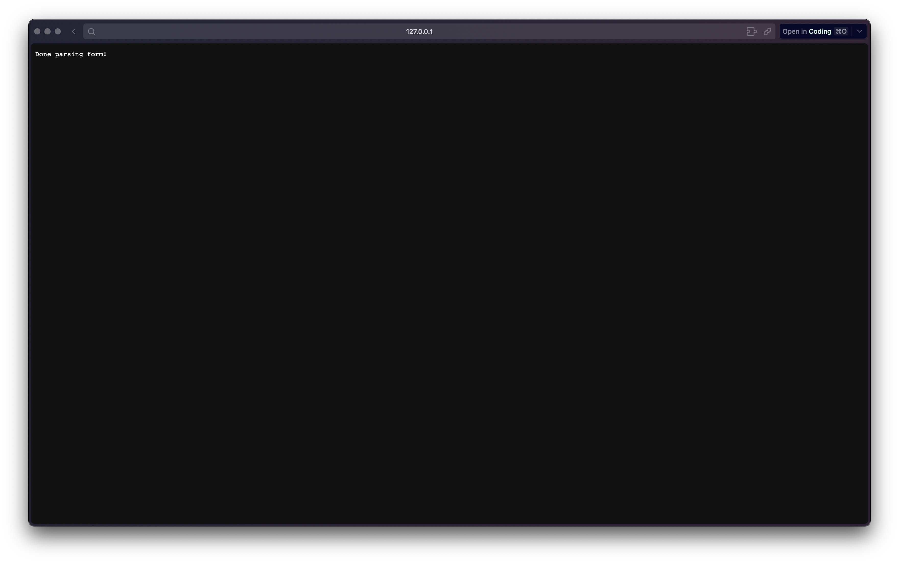

# Handling File Inputs With Busboy in NodeJS

In this post we'll be exploring how to use the busboy module to parse form data in Node.js. We'll be using the busboy module to parse form data from a file upload form. We'll also be using the file system module to save the file to the file system.

## Getting Started

In an empty folder run the following command to create a package.json file

```bash
npm init -y
```

Then run the following command to intialize a git repository

```bash
git init
```

Create a `.gitignore` file and add the following line to it. This will tell git to ignore the `node_modules` folder when we push to our repository.

```
node_modules
```

Finally run the following command to install the busboy module which we'll be using to parse the form data

```bash
npm install busboy
```

Inside of the folder you created, create a file called `index.js` and one called `index.html` and open them in your favorite text editor.

## Writing the HTML

Here's what your index.html file will look like. On the form the action attribute is set to the url of the server we'll be creating. The method is set to `POST` and the enctype is set to `multipart/form-data`. This is what tells the browser to send the form data as a multipart request that can be parsed by busboy.

```html
<!DOCTYPE html>
<html lang="en">
  <head>
    <meta charset="UTF-8" />
    <meta http-equiv="X-UA-Compatible" content="IE=edge" />
    <meta name="viewport" content="width=device-width, initial-scale=1.0" />
    <title>Node Busboy</title>
  </head>

  <body>
    <form
      action="http://127.0.0.1:3000"
      method="post"
      enctype="multipart/form-data"
    >
      <label for="name">
        Name
        <input type="text" name="name" />
      </label>

      <label for="email">
        Email
        <input type="text" name="email" />
      </label>

      <label for="file">
        File
        <input type="file" name="file" />
      </label>

      <button type="submit">Submit</button>
    </form>
  </body>
</html>
```

Here's what the form will look like in the browser



## Writing the Code

Here's what your package.json will look like after installing busboy

```json
{
  "name": "busboy-node",
  "version": "1.0.0",
  "description": "",
  "main": "index.js",
  "scripts": {
    "test": "echo \"Error: no test specified\" && exit 1"
  },
  "author": "",
  "license": "ISC",
  "dependencies": {
    "busboy": "^1.6.0"
  }
}
```

Now we'll import the busboy module along with some other packages for our server and handling the file system

```js
// index.js

const http = require("http");
const fs = require("fs");
const os = require("os");
const path = require("path");
const busboy = require("busboy");
```

Then we'll set the host and port for our server

```js
// index.js

const hostName = "127.0.0.1";
const port = 3000;
```

Now that we have all of our dependencies and variables set up, we can create our server. Here's a play by play of what's happening in this code block:

1. We create a server with the `http.createServer` method
2. We set the `Content-Type` header to `text/plain`. This is what we'll be sending back to the client
3. We check if the request method is `POST`. If it is, we'll parse the form data with busboy
4. If the form data is a file, we'll get the filename, encoding and mimeType from the info object
5. We set the path to save the file. For me that was my home directory + `/Downloads` but you can change it to whatever you want/need.
6. We save the file to the path we set in step 5
7. If the form data is a field, we'll log the name and value of the field
8. Finally we pipe the request to busboy to parse the form data

```js
// index.js

const server = http.createServer((req, res) => {
  res.setHeader('Content-Type', 'text/plain');

  if (req.method === 'POST') {
    const bb = busboy({ headers: req.headers });
    bb.on('file', (name, file, info) => {
      // destructuring the info object to get the filename, encoding and mimeType
      const { filename, encoding, mimeType } = info;
      console.log(
        `File [${name}]: filename: ${filename}, encoding: ${encoding}, mimeType: ${mimeType}}`);

      // set the path to save the file
      const saveTo = path.join(`${os.homedir()}/Downloads`, `${filename}`);

      console.log(`File [${name}] is saving to ${saveTo}`)

      // save the file
      file.pipe(fs.createWriteStream(saveTo));

      file.on('data', (data) => {
        console.log(`File [${name}] got ${data.length} bytes`);
      }).on('close', () => {
        console.log(`File [${name}] done`);
      });
    });
    bb.on('field', (name, val, info) => {
      console.log(`Field [${name}]: value: `, val);
    });
    bb.on('close', () => {
      console.log('Done parsing form!');
      res.end('Done parsing form!');
    });

    // pipe the request to busboy to parse the form data
    req.pipe(bb);
  }
```

Now we'll listen on the port we set earlier

```js
// index.js

server.listen(port, hostName, () => {
  console.log(`Server running at http://${hostName}:${port}/`);
});
```

## Testing it Out

Now that we have our server set up, we can test it out. Run the following command to start the server

```bash
node index.js
```

Then find the index.html file in your file system and open it in your browser. Fill out the form and click submit, which will present you will the following view in your browser.



In your terminal you should see the following output along with a bunch of other logs from busboy. You'll also see a file the file you uploaded in your Downloads folder.

```bash
Server running at http://127.0.0.1:3000/
File [avatar]: filename: test.png, encoding: 7bit, mimeType: image/png
Field [name]: value: Mitchell
Field [email]: value: mitchell@email.com
Done parsing form!
```

You can alternatively open the index.html file by running the following command

```bash
open index.html
```

## Alternative HTML Form

Instead of created an HTML file you could also handle a GET request on the server and send back an HTML form. Here's what the code would look like. You would put this after the if statement that checks if the request method is `POST`

```js
// index.js

else if (req.method === 'GET') {
    res.statusCode = 200;
    res.setHeader('Content-Type', 'text/html');
    // send a form with a two text inputs and one file input
    res.end(`
      <form action="/" method="post" enctype="multipart/form-data">
        <input type="text" name="name" placeholder="name">
        <input type="text" name="email" placeholder="email">
        <input type="file" name="avatar">
        <button type="submit">Submit</button>
      </form>`);
  }
```

## Conclusion

In this tutorial we learned how to use busboy to parse form data in Node. We also learned how to save files to the file system.

If you have any questions or comments, feel free to reach out to me on Twitter [@mitchelldirt](https://twitter.com/mitchelldirt) or by email at [developer@mitchellmudd.dev](mailto:developer@mitchellmudd.dev)

Thanks so much for reading! 🎉

## Resources

- This Net Ninja Series on how streams and buffers work in Node is fantastic. The whole series is great if you interested in learning more about Node.

<iframe width="560" height="315" src="https://www.youtube.com/embed/GlybFFMXXmQ" title="YouTube video player" frameborder="0" allow="accelerometer; autoplay; clipboard-write; encrypted-media; gyroscope; picture-in-picture; web-share" allowfullscreen></iframe>

- Here's a reference to unix terminal commands that you can use to navigate your file system and more. [Unix Commands](https://www.tjhsst.edu/~dhyatt/superap/unixcmd.html)
- The [Busboy Documentation](https://github.com/mscdex/busboy) is great. It's actually where I got most of the javascript code for this tutorial.
- Node's api documentation is great to keep on hand. Just make sure you pick the right version to view haha. [Node API Documentation](https://nodejs.org/api/)
- Learn more about forms on MDN using the [MDN Forms](https://developer.mozilla.org/en-US/docs/Learn/HTML/Forms) series.
