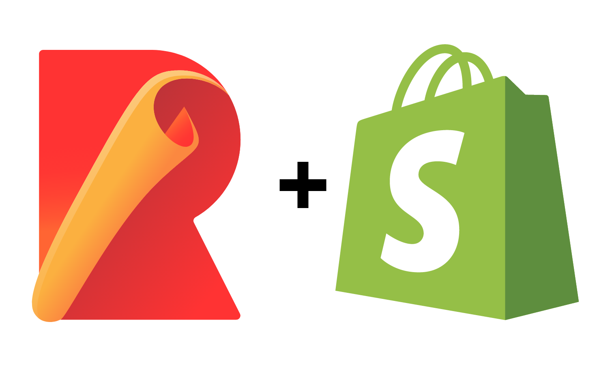

## Why would you want to use a theme app extension?

The extensions can act like sections in your merchants theme. This gives the merchant the freedom to decide where to put your app extension. A personal benefit that I've experienced from using an extension is the ability to use [Tailwindcss](https://tailwindcss.com) instead of the vanilla CSS that Shopify provides.

## What are some drawbacks to using a theme app extension?

The way that Shopify expects your code to come in can be quite rigid. You aren't allowed to have any additional folders or files in your app extension. The biggest issue that I ran into was not being able to import files into my main JavaScript file. This is where code splitting using rollup js comes in.

## What is code splitting and how can rollup js help?

Code splitting is a technique that allows you to split your code into multiple files. This allows you to import files into your main JavaScript file. This is a great way to organize your code and keep it clean. Rollup js is a module bundler that can help you accomplish this. Rollup is the underlying technology that powers [Vite](https://vitejs.dev) -- [an incredibly popular](https://2022.stateofjs.com/en-US/libraries/tier_list?) tool for developing front end applications...

<!--truncate-->

## What this post will not teach you

This post will not be teaching you how to create a Shopify App or how to create a Shopify theme extension. If you're interested in learning how to do that, I recommend checking out the [resources section](#resources).

## Walkthrough

### Step 1: Create dev-extensions folder

After you've created your Shopify App and your theme extension, you'll need to create a new folder in the root of your app called `dev-extensions`. This is where you'll be writing your code.


### Step 2: Create assets and blocks folders

Inside the `dev-extensions/name-of-extension` folder, create two new folders. One called assets and one called blocks. The assets folder is where you'll be putting your JavaScript and CSS files. The blocks folder is where you'll be putting your liquid files.


### Step 3: Run npm/yarn init within the `dev-extensions/name-of-extension` folder

#### npm

```bash
npm init -y
```

#### yarn

```bash
yarn init -y
```

### Step 4: Install the necessary dependencies

#### npm

```bash
npm install @rollup/plugin-commonjs rollup rollup-plugin-copy --save-dev
```

#### yarn

```bash
yarn add @rollup/plugin-commonjs rollup rollup-plugin-copy --dev
```

Your package.json should look like this now


**Note**: You'll need to set the `type` to `module` in your package.json file. This is because we're using ES6 modules.

```json
  "type": "module"
```

### Step 5: Create a rollup.config.js file

**Make sure you replace `code-splitting-example` in the file path with your own extension name**

```js
import commonjs from "@rollup/plugin-commonjs";
import copy from "rollup-plugin-copy";

const input = {
  app: "./assets/app.js",
};

export default {
  input,
  output: {
    dir: "../../extensions/code-splitting-example/assets",
  },
  plugins: [
    commonjs(),
    copy({
      targets: [
        { src: "./assets/*.css", dest: "../../extensions/code-splitting-example/assets" },
        {
          src: "./blocks/*.liquid",
          dest: "../../extensions/code-splitting-example/blocks",
        },
      ],
    }),
  ],
};
```

### Step 6: Create a build script in your package.json

```json
  "scripts": {
    "build": "rollup -c"
  }
```

### Step 7: Create your JavaScript, CSS, and Liquid files


### Step 8: Populate the files with the following code

#### app.js

```js
import { add } from "./other.js";

console.log(add(1, 2));

console.log("Hello from app.js");
```

#### other.js

```js
export function add(a, b) {
  return a + b;
}
```

#### main.css

```css
#extension {
  background-color: red;
}
```

#### block.liquid

```html
<html>
  <head></head>
  <body>
    <h1 id="extension">Hello from block.liquid</h1>
  </body>
</html>


  {
    "name": "Code-Splitting-Example",
    "target": "section",
    "stylesheet": "main.css",
    "javascript": "app.js"
  }

```

As you can see, I've imported the `add` function from the `other.js` file into the `app.js` file. This is what we want to accomplish. This code splitting technique will keep our code organized and clean.

### Step 9: Run the build script

#### npm

```bash
npm run build
```

#### yarn

```bash
yarn build
```

As you can see the main.css file and block.liquid file have been copied exactly as they are into the `extensions/name-of-extension/assets` and `extensions/name-of-extension/blocks` folders respectively. The app.js file has been bundled into a single file and has been copied into the `extensions/name-of-extension/assets` folder.

```javascript
// The new app.js file
function add(a, b) {
  return a + b;
}

console.log(add(1, 2));

console.log("Hello from app.js");
```

## Notes

Make sure that after you run the build command that you save the updated files in the extensions folder. That way when you run the `npm run deploy` command from the root of your app, the updated files will be uploaded to Shopify.

Speaking of the above command. Make sure you run the build command from the extension folder and the deploy command from the root of your app. You could potentitally set up the build command to target the dev-extensions folder, but if you have more than one extension you may run into issues.

## Conclusion

If you copied the code from this post exactly, you should be able to run the `npm run deploy` or `yarn deploy` command from the root of your app and see the following in your theme editor.


I hope this post has helped you understand how to use code splitting with rollup js 😇. If you have any questions or comments, feel free to reach out to me on [Twitter](https://twitter.com/mitchelldirt).

## Resources

- [Shopify App CLI](https://shopify.dev/docs/apps/tools/cli#getting-started)
- [Shopify Theme Extension CLI](https://shopify.dev/docs/apps/online-store/theme-app-extensions/getting-started)
- [What is code splitting?](https://reactjs.org/docs/code-splitting.html)
- [Rollup js](https://www.rollupjs.org/)
- [Code Repository](https://github.com/mitchelldirt/code-splitting-example)