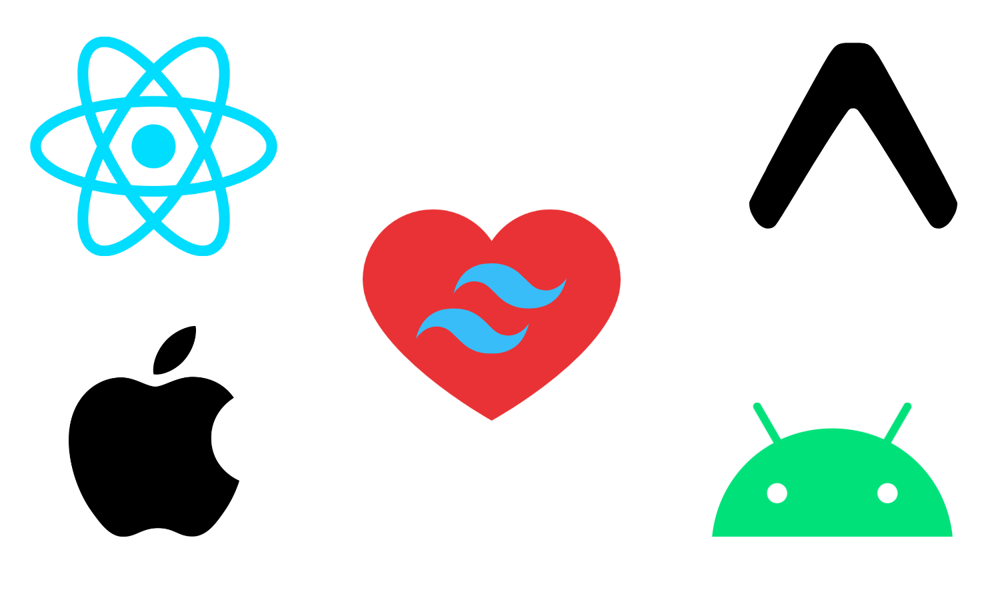
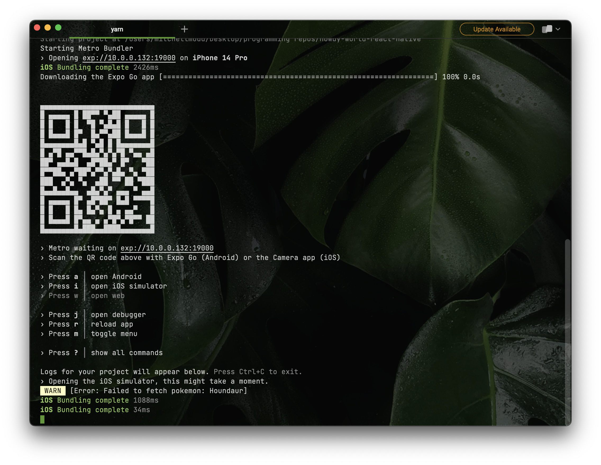
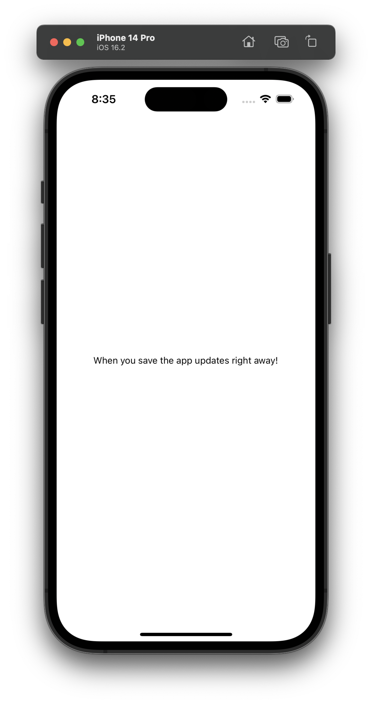
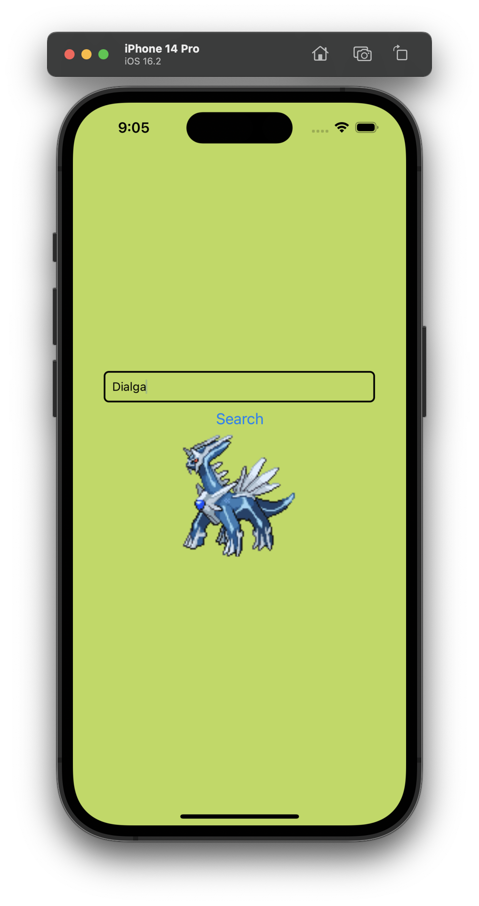

import ReactPlayer from 'react-player'



## What is React Native?

[React Native](https://reactnative.dev) is a framework that allows you to build mobile applications using JavaScript (React).

## Okay but what is Expo and why should I use it?

In Expo's own words:

> Expo is an open-source framework for apps that run natively on Android, iOS, and the web. Expo brings together the best of mobile and the web and enables many important features for building and scaling an app.

> The expo npm package enables a suite of incredible features for React Native apps. The expo package can be installed in nearly any React Native project.

<!--truncate-->

## How to get started

Per these instructions from the official React Native docs

> [React Native Expo Start](https://reactnative.dev/docs/environment-setup)

You can easily get started with an Expo React Native project by running the following commands:

```bash
# First create a new project
yarn create expo-app AwesomeProject

# Then cd into the project
cd AwesomeProject

# Finally start the project
yarn expo start
```

You'll be greeted with a QR code that you can scan with the Expo Go app on your phone. This will allow you to actually see your application running on your phone. This in my opinion was the absolute coolest part. I never imagined it would be this easy to see the output of my code on my phone 🤯.



***Throughout this tutorial I show off the iOS simulator because it was easier to screenshot, but in practice I used the Expo Go app on my phone. Keep in mind that this will all work on the Android app as well*** 😛


## Making changes to the code

Initially the App component code will look like this:

```jsx
export default function App() {
  return (
    <View style={styles.container}>
      <Text>Open up App.js to start working on your app!</Text>
      <StatusBar style="auto" />
    </View>
  );
}
```

Then after editing the code and saving it, the app will automatically reload and show the new changes.

```jsx
export default function App() {
  return (
    <View style={styles.container}>
      <Text>When you save the app updates right away!</Text>
      <StatusBar style="auto" />
    </View>
  );
}
```



## Making the app actually do something

Let's make the app actually do something. I'm going to use the [PokeAPI](https://pokeapi.co) to fetch some Pokemon data and display it on the screen. In the below example I'm using the Tanstack Query Package to fetch the data which you can learn about [here](https://tanstack.com/query/latest).

Something that I thought was interesting was all of the default components for things like text and images. Unlike HTML using `<p>` and `` tags you have to use the React Native components. For example, to display text you use the `<Text>` component and to display an image you use the `<Image>` component.

```jsx
// App.jsx

import { StatusBar } from 'expo-status-bar';
import { useState } from 'react';
import { Button, StyleSheet, TextInput, View } from 'react-native';
import {
  QueryClient,
  QueryClientProvider,
} from '@tanstack/react-query';

import Pokemon from './components/Pokemon';

// These are the styles for the App.js file - It's just JSX css styling... i think
const styles = StyleSheet.create({
  container: {
    flex: 1,
    backgroundColor: '#BADA55',
    alignItems: 'center',
    justifyContent: 'center',
  },

  textInput: {
    height: 40,
    borderColor: 'gray',
    borderWidth: 1,
    width: 200,
    margin: 10,
    padding: 10,
    borderRadius: 5,
  },
});

// Initialize the query client for tanstack/react-query
const queryClient = new QueryClient();

export default function App() {
  // State to control the pokemon name
  const [name, setName] = useState('pikachu');
  const [pokemon, setPokemon] = useState(name);

  return (
    <QueryClientProvider client={queryClient}>
      <View style={styles.container}>
        <TextInput style={styles.textInput} placeholder='Enter Pokemon Name' onChangeText={setName} value={name} />
        <Button title='Search' onPress={() => { setPokemon(name) }} />
        <Pokemon name={pokemon} />
      </View>
      <StatusBar style="dark" />
    </QueryClientProvider>
  );
}
```

```jsx
// Pokemon.jsx

import { useQuery } from '@tanstack/react-query';
import { Image, Text, View, StyleSheet } from 'react-native';

// JSX styling
const styles = StyleSheet.create({
  container: {
    paddingTop: 50,
  },
  tinyLogo: {
    width: 50,
    height: 50,
  },
  logo: {
    width: 66,
    height: 58,
  },
});

// This is the query function for tanstack/react-query
async function queryPokemonApi(name) {
  const data = await fetch(`https://pokeapi.co/api/v2/pokemon/${name.toLowerCase()}`);

  if (data.status !== 200) {
    throw new Error('Failed to fetch pokemon: ' + name);
  }

  const json = await data.json();
  return json;
}

// Queries the pokemon API and returns the pokemon image
export default function Pokemon({name}) {
  const query = useQuery({ queryKey: ['getPokemon', name], queryFn: () => queryPokemonApi(name) });

  if (query.isLoading) {
    return <Text>Loading...</Text>;
  }

  if (query.isError) {
    return <Text>Error: {query.error.message}</Text>;
  }

  return (
        <View>          
          <Image style={styles.logo} source={{ uri: query.data.sprites.front_default}} />
        </View>
  )
}
```

***Behold my glorious Pokemon app*** ✨

<ReactPlayer width='375px' loop={true} playing={false} controls={true} url='/pokemon-styled-vid.mp4' />


## But wait, I actually don't want to use styled components

The above code uses styled components. That's the part in the code that goes like this:

```jsx
const styles = StyleSheet.create({
  container: {
    paddingTop: 50,
  },
  tinyLogo: {
    width: 50,
    height: 50,
  },
  logo: {
    width: 66,
    height: 58,
  },
});
```

Styled components are great, but I'm a big fan of Tailwind CSS. I was sad that I couldn't use Tailwind in my React Native application 😭 until...

>Enter [Native Wind](https://nativewind.dev).

<ReactPlayer width='375px' playing={true} controls={false} loop={true} url='/tailwind-wwe.mp4' />

Native Wind is awesome (if you like Tailwind lol) because it allows you to use Tailwinds utility classes in your React Native applications. This way you don't have to manage any stylesheets. You can just use the utility classes that you're already familiar with.

## Refactoring my styled components to tailwindcss 

First I had to install Native Wind and set up some other stuff. You can set up **your** application for native wind using [this guide](https://www.nativewind.dev/quick-starts/expo). After installation I could start working with my beloved Tailwind classes 🥰.

Side note: If you can't stand seeing all those classes (I know they're ugly 🤢) you can use the [inline fold extension for vscode](https://marketplace.visualstudio.com/items?itemName=moalamri.inline-fold)

Below is the refactored code using Native Wind:

```jsx
// App.jsx

import { StatusBar } from 'expo-status-bar';
import { useState } from 'react';
import { Button, TextInput, View } from 'react-native';
import {
  QueryClient,
  QueryClientProvider,
} from '@tanstack/react-query';

import Pokemon from './components/Pokemon';

// Initialize the query client for tanstack/react-query
const queryClient = new QueryClient();

export default function App() {
  // State to control the pokemon name
  const [name, setName] = useState('pikachu');
  const [pokemon, setPokemon] = useState(name);

  return (
    <QueryClientProvider client={queryClient}>
      <View className="w-full h-full flex flex-column items-center justify-center bg-[#BADA55]">
        <TextInput className="border-2 border-black rounded-md w-80 p-2" placeholder='Enter Pokemon Name' onChangeText={setName} value={name} />
        <Button className="bg-blue-500 text-white rounded-md p-2 mt-2" title='Search' onPress={() => { setPokemon(name) }} />
        <Pokemon name={pokemon} />
      </View>
      <StatusBar style="dark" />
    </QueryClientProvider>
  );
}
```

```jsx
// Pokemon.jsx
import { useQuery } from '@tanstack/react-query';
import { Image, Text, View } from 'react-native';

// This is the query function for tanstack/react-query
async function queryPokemonApi(name) {
  const data = await fetch(`https://pokeapi.co/api/v2/pokemon/${name.toLowerCase()}`);

  if (data.status !== 200) {
    throw new Error('Failed to fetch pokemon: ' + name);
  }

  const json = await data.json();
  return json;
}

// Queries the pokemon API and returns the pokemon image
export default function Pokemon({name}) {
  const query = useQuery({ queryKey: ['getPokemon', name], queryFn: () => queryPokemonApi(name) });

  if (query.isLoading) {
    return <Text>Loading...</Text>;
  }

  if (query.isError) {
    return <Text>Error: {query.error.message}</Text>;
  }

  return (
        <View>          
          <Image className="w-40 h-36" source={{ uri: query.data.sprites.front_default}} />
        </View>
  )
}
```
**And this is the result (I took a couple creative liberties e.g. the size of the pokemon image and color of the input border lol)**



## Conclusion

If you followed along you're probably also blown away by how cool the Expo Go app and React Native development experience is 🤯. I'm excited to use these tools in an upcoming project and I hope you are too 🚀 If you have any questions or comments feel free to reach out to me on [Twitter](https://twitter.com/mitchelldirt)!

## Resources

- [The code written in this post](https://github.com/mitchelldirt)
- [React Native](https://reactnative.dev)
- [Expo](https://docs.expo.dev/)
- [Native Wind](https://nativewind.dev)
- [PokeAPI](https://pokeapi.co)
- [Tanstack Query](https://tanstack.com/query/latest)