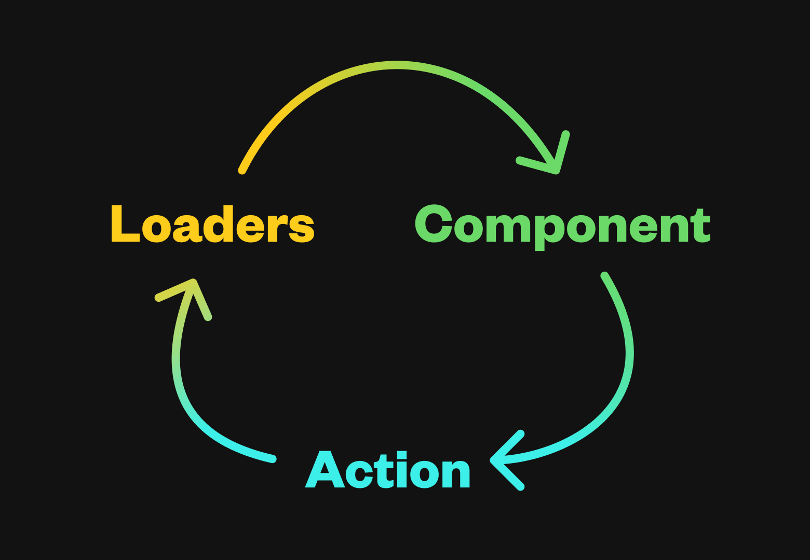
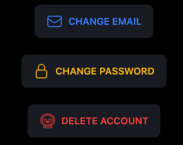
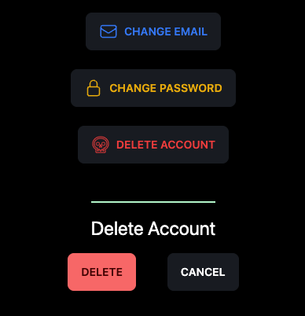

In this blog post, I'll share my experience using Remix and provide some insights into what made it a valuable tool for my project, as well as areas where I could have improved. Whether you're new to Remix or looking for ways to enhance your workflow, I hope this post will help you appreciate the benefits of this powerful framework. Let's go 🚀!

[Remix](https://remix.run/) is a full-stack React framework similar to [Next.js](https://nextjs.org/). Their mission statement reads:

> Focused on web standards and modern web app UX, you’re simply going to build better websites

<!--truncate-->

After having built my first web app ["Tasky"](https://tasky-remix.fly.dev/) using the framework, I agree that you will build a better website for both the developer and the end user by using Remix. As I was working on Tasky I found myself getting excited by just how simple Remix was, while their adherence to web standards meant that I found myself looking through MDN Docs just as much as the Remix ones!

## What do I actually like about Remix?

There were three things that I really enjoyed about Remix:

1. Data flow
2. Nested routing
3. Performance?

### Data Flow



This is my favorite feature of Remix by far! The _Loader => Component => Action_ flow is so simple and intuitive. Within a Remix route, a loader will run first and allows you to fetch data. This would be similar to using the [useEffect](https://react.dev/reference/react/useEffect) hook or the [Tanstack](https://tanstack.com/query/v4/docs/react/guides/queries) query with React. The biggest difference is that a loader runs on the server and fetches the data prior to the component rendering essentially removing the need for loading spinners 🤯.

Next, the component renders potentially with data from the loader. If you're building a more interactive app like the project I built you'll be using actions within each route. An action is like a loader in that it runs on the server and instead of grabbing data, it submits data from the component. A great example of this would be a login form where a user would provide their email and password and the action would verify that the information was correct and then route them to the home page.

Once I used the loader, component, action flow a few times I really found myself enjoying the developer experience to a degree I hadn't in other React frameworks. If you want to learn more about the way data flow works in Remix I highly recommend [this article](https://remix.run/blog/remix-data-flow) 😇

Here's an example of the above data flow using code from my project. This route allows you to edit a task that appears after using the search feature :)

```jsx
// /routes/search/task/$taskId.tsx

// LOADER
export async function loader({ params, request }: LoaderArgs) {
  if (typeof params.taskId !== "string") {
    throw new Error("Uh Oh");
  }

  const userId = await getUserId(request);

  if (!userId) {
    return { redirect: "/login" };
  }

  // get the current url
  const url = new URL(request.url);

  const projects = await getProjects({ userId: userId });
  const task = await getTaskById({ id: params.taskId });

  return {
    taskContext: { task: task, projects: projects },
    noneId: `none-${userId}`,
    previousRoute: url.pathname.slice(0, url.pathname.indexOf("/task")),
  };
}

// COMPONENT
export default function EditTaskRoute() {
  const data = useLoaderData<typeof loader>();

  if ("taskContext" in data) {
    if (!data || !isValidData(data.taskContext)) {
      return <p>Something went wrong</p>;
    }

    return (
      <>
        <EditTask
          previousRoute={data.previousRoute}
          taskContext={data.taskContext}
          noneId={data.noneId}
        />
        <LiveReload />
      </>
    );
  }

  return <p>Something went wrong</p>;
}

// ACTION
export async function action({ request }: ActionArgs) {
  const data = await request.formData();
  const title = data.get("title");
  const description = data.get("description");
  const project = data.get("project");
  const priority = data.get("priority");
  let dueDate = data.get("dueDate");
  let dueTime = data.get("dueTime");
  const taskId = data.get("id");
  const previousRoute = data.get("previousRoute");

  const cookies = request.headers.get("Cookie");
  if (!cookies) throw new Response("No cookies found", { status: 400 });
  const tzCookieValue = grabCookieValue("tz", cookies);

  const userId = await getUserId(request);
  if (userId === undefined) return redirect("/login");

  //TODO: Throw some zod validations here
  try {
    const taskIdSchema = z.object({
      id: z.string(),
    });

    let time = false;
    let formattedDueDate = null;

    if (dueDate && dueTime === "") {
      const serverOffset = new Date().getTimezoneOffset();
      formattedDueDate = addHours(
        new Date(dueDate + "T00:00:00.000Z"),
        serverOffset / 60
      );
      console.log("formatted due date", formattedDueDate);
    }

    if (!dueDate && dueTime) {
      return badRequest({
        formError: "Please select a date",
      });
    }

    if (
      dueDate &&
      dueTime &&
      dueTime.length > 0 &&
      typeof dueDate === "string"
    ) {
      const serverOffset = new Date().getTimezoneOffset();
      const seconds = dueTime.length === 5 ? ":00" : "";
      formattedDueDate = addHours(
        new Date(dueDate + "T" + dueTime + seconds + ".000Z"),
        serverOffset / 60
      );
      time = true;
    }

    switch (request.method) {
      case "PATCH": {
        await updateTask(
          taskIdSchema.parse({ id: taskId }),
          z.string().parse(title),
          z.string().parse(description) || "",
          z.number().parse(Number(priority)),
	z.date().nullable().parse(formattedDueDate),
          z.boolean().parse(time),
          z.string().parse(project),
          z.string().parse(tzCookieValue)
        );
        return redirect(z.string().parse(previousRoute) || `/home`);
      }
    }
  } catch (error) {
    console.error(error);
  }

  return badRequest({
    formError: "Uh oh - something went wrong on our end.",
  });
}
```

### Nested Routing

This feature while being one of my favorites was definitely the one I got confused about the most. Nested routing allows you to essentially use the URL to allow multiple routes to appear on the page at the same time. [This article](https://remix.run/docs/en/1.15.0/guides/routing#what-is-nested-routing) does a great job of going into the full details of nested routing.

An example of nested routing in my app is on the profile page. There's a button that allows you to delete your profile and when you click on it a nested route appears below confirming that you'd actually like to go through with that action.





### Performance

I love how performant Remix feels. From utilizing fewer network requests to creating a better developer experience that could theoretically lead to better performance

Whether developer experience provides any gain to the end-user experience is 🚨 subjective af 🚨

What I know for sure is that the way that the data flow works in Remix leads to smaller [network request waterfalls](https://medium.com/codes-n-coffee/how-waterfall-chrome-dev-tool-helps-to-understand-the-nature-of-a-website-bc4c9e5ed595). Using loaders on the server also means that instead of seeing a bunch of loading spinners things will usually just _✨appear✨_.

These two articles provide a comprehensive overview of how performant Remix **is** and **can potentially be**:

[Remix vs. Next.js](https://remix.run/blog/remix-vs-next)

[Remix Performance](https://remix.run/docs/en/main/guides/performance)

## How could I have used Remix better

### useFetcher Remix hook

The useFetcher hook can be used to utilize a loader or action without it being tied to a route change. Remix says in [this article](https://remix.run/docs/en/1.15.0/hooks/use-fetcher) that this is especially useful for a "to-do app". I didn't take advantage of the useFetcher hook at all because I was able to accomplish what I needed without it, but if I had used it I think I could've saved a lot of time and complexity.

### Error/Catch Boundaries

Each route can contain an error/catch boundary. When you **throw** within a loader or action you can render a catch boundary to show the error where the nested route appears

**Catch Boundary Example:**

```js
export function loader() {
  throw new Error("I am a failure!");
}
```

```jsx
export function CatchBoundary() {
  const caught = useCatch();

  return (
    <>
      <div>
        ERROR: {caught.statusText} {caught.status}
      </div>
      <div>{caught.data.message}</div>
    </>
  );
}
```

An error boundary can be used when you get an error in a route that you weren't expecting i.e. you didn't throw an error to be caught by a catch boundary.

**Error Boundary Example:**

```jsx
export function ErrorBoundary({ error }) {
  console.error(error);
  return (
    <html>
      <head>
        <title>Oh no!</title>
        <Meta />
        <Links />
      </head>
      <body>
        {/* add the UI you want your users to see */}
        <Scripts />
      </body>
    </html>
  );
}
```

I didn't spend time implementing these boundaries in the project I worked on because I don't write bugs... just kidding :) I decided against it for time reasons. A todo app is a fairly straightforward CRUD application and my goal for this project was to create a good web app in a reasonable, not a perfect one.

> Perfect is the enemy of the good
>
> -Voltaire

### Date time management

This isn't related to Remix at all, but because of the server-side rendering pattern that Remix uses, I was forced to think about how to manage my dates for once.

If you took some time to skim through my commits you'll find **A LOT** of commit messages referencing me "fixing" date time bugs. This project forced me to get better at handling dates since I needed this to-do list app to work regardless of time zone.

When I first started working on this app I stored everything in the user's local time zone and then ran into issues when I would try to do the following:

```js
new Date(dateFromServer);
```

I had stored the dates in a way in which when creating a new date object it would apply the UTC offset to the date that already had the users offset. This means if you were in GMT -4 and the time in the database was 12:00:00 that when I rendered it to the screen it would show up at 08:00:00.

Another issue was that if you changed time zones the entire app would get jumbled up. The way that I fixed these issues was by simply storing the date in UTC in the database and then changing it to the user's local time when rendering. The easiest way I found to do this was by storing the user's timezone as a cookie 🍪. I could use the cookie in my Remix action to change the date to UTC with **zonedTimeToUTC** from the [date-fns tz library](https://www.npmjs.com/package/date-fns-tz).

## Conclusion

Remix is awesome and the more you fully commit to using all of its features the better the developer experience becomes. The adherence to web standards where possible means that the fundamentals you learned about javascript finally get used instead of being forced to use some proprietary data fetching methods. I can't wait to use Remix on future projects and I hope after reading this that you're ready to try it out! 🚀

## Resources

[My project "Tasky"](https://tasky-remix.fly.dev)

[The code base for my project](https://github.com/mitchelldirt/tasky)

[Remix's Website](https://remix.run/)

[Data Flow in Remix](https://remix.run/blog/remix-data-flow)

[Nested Routing in Remix](https://remix.run/docs/en/1.15.0/guides/routing#what-is-nested-routing)

[What are Network Waterfalls?](https://medium.com/codes-n-coffee/how-waterfall-chrome-dev-tool-helps-to-understand-the-nature-of-a-website-bc4c9e5ed595)

[Remix vs NextJS](https://remix.run/blog/remix-vs-next)

[How can you make Remix even more performant?](https://remix.run/docs/en/main/guides/performance)

[useFetcher Hook](https://remix.run/docs/en/1.15.0/hooks/use-fetcher)
