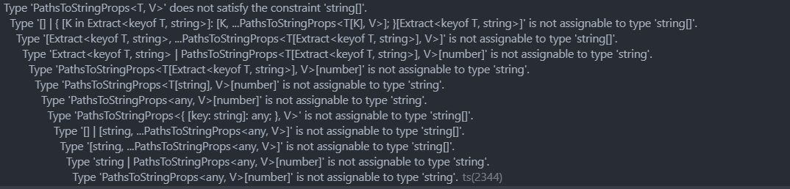

I loved TypeScript in 50 Lessons! The book divvies up the fundamentals along with more advanced topics of TypeScript into 50 bite-sized lessons which took me around two months to read doing a lesson or two a night. The smaller lessons always helped me feel as though I was making progress even when I wasn’t feeling happy with my ability to comprehend the topics, it definitely aided me in finishing the book.

The book is written by the brilliant Stefan Baumgartner. He’s a TypeScript wizard and I always end up running into his articles. He recently announced a new book “The TypeScript Cookbook” which will be released through O’Reilly Books and you can find out more about him [here](https://fettblog.eu/about/). Now I’ll get on with the review 🤪

## The good parts

### The Book Holds Up

The book was published in October 2020 and for a programming book depending on the topic that can be a **long** time. Stefan addresses concerns over his content becoming outdated early on in the introduction stating,

> That’s why we focus on the long-lasting aspects of the type system. The main program will be javascript; TypeScript will work as an additional type layer describing the behavior of our code. This is also aligned with the way the TypeScript team design their upcoming work. After reading this book, you will immediately understand what new features are about.

I only ran into a couple of cases of errors showing up that weren’t addressed in the book, but they didn’t really stop me as I could just `// @ ts-ignore` to allow the code to work as intended. I believe they may have been caused by a more overly zealous ts config than was around in 2020, or maybe just a typo on my part 😅.

### Generics and Errors

**Generics!** Did I scare you? Well before I read this book generics scared me and by scared I mean confused the heck out of me. Whenever I got an error involving generics the overwhelming amount of text would stress me out and instead of trying to read and understand the error message, I would typically head straight to Google.

Found this random picture of a TypeScript error haha

Now when I run into them I can do a much better job of breaking each part down until I understand that maybe the generic takes in type t, but I’m passing in t OR undefined. While on the topic of errors, I think one of the best reasons to read this book is just to level up your debugging skills in TypeScript. The more knowledge that I gained through this book the more confident I felt debugging my TypeScript code **before** exiting my debugger to scurry off to Google 🐀.

### I just like it 🫢

This book has a lot of solid content that truly justified the price for me ($49 right now for the hardcover book and e-book). I learned how to properly type functions and learned that there’s a time and place for explicit typing and that implicit typing can save you loads of mental overhead. I didn’t even know about value types before reading this book 🤯! The writing style and language used it easy to follow and like all the fun chapter drawings haha.

## The hard parts

### The beginning

The beginning wasn’t as hard as it was a bit of a slog. I already knew some TypeScript so reading through some of the stuff on ts-config and the basics of types was a bit boring. The upside to this was that I actually did still learn some stuff that I didn’t know. The idea of left and right-hand types, sub and super types, and top and bottom types were all things that I may have known the concept of but the terminology was lost on me.

### Generics and Conditional Types

Generics still confuse me a bit haha. This book definitely helped me figure out firstly **why** you might use them (libraries and something like an NPM package are examples). I won’t dwell on them because I already covered them in the “good parts” section.

Conditional types also caused me some problems. The use of many ternaries that typically ends in the type of never stumped me at first. Then I realized it’s literally **just** a bunch of ternary statements together and you can treat it as IF… ELSE… IF… ELSE… never. 

## What now

### Personal Project

I’ve already started working on a full-stack project that uses TypeScript on both the front-end and back-end. You can check out my progress [here :)](https://github.com/mitchelldirt/woofer-api). It’s a social media app (Twitter clone) that uses Express, Drizzle, Zod, and Postgres. I’m super excited to continue learning more about TypeScript by working on this project! 

### TypeScript Type Challenges
I haven’t started working on this yet, but I’d love to take a crack at some of [these type challenges](https://github.com/type-challenges/type-challenges) from the type challenges repository on GitHub. They have **A TON** of challenges and if I’m ever stuck the channel [Michigan TypeScript](https://www.youtube.com/playlist?list=PLOlZuxYbPik180vcJfsAM6xHYLVxrEgHC) has a solution video for every single one.

## Finale 🎭
This book is awesome and if you want to improve your TypeScript and support a great author you should consider purchasing it. Thank you for reading! 🎉