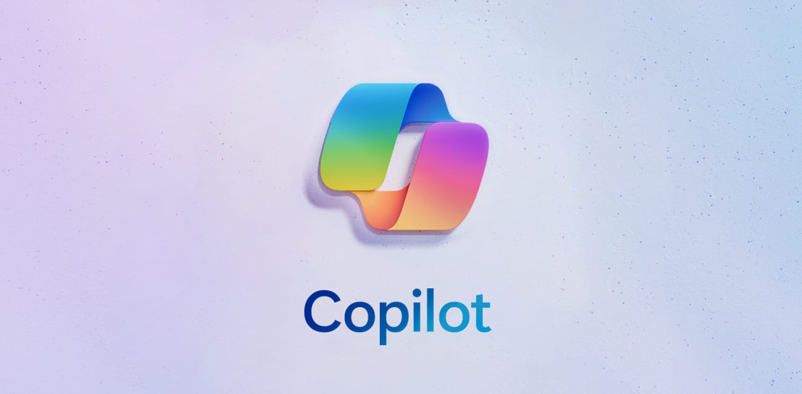

<!--Write about the webinar that you watched and what copilot is-->

Today I watched a webinar by Microsoft titled `Future of Work: Leading Innovation in the Era of AI-Powered Productivity`. 
It offered an interesting insight into where CoPilot is now, how you can prepare for the future of AI, and concerns over 
the privacy/security of generative AI. One interesting thing I learned Copilot is capable of in Microsoft Teams is being able to tell you the *sentiment* of the meeting you're in. It's like having an impartial third party oversee your meeting. Over the next few minutes, you'll get to read my key takeaways from the webinar 
and get some useful links to learn more 😄

<!--truncate-->

## How to prepare for Copilot

1. Go through your current company data (SharePoint, OneDrive, etc.) and try your best to clean it up.

> `goodDataIn = goodDataOut`

2. Be curious. This was repeatedly stressed by the first set of presenters. You **should** be trying new things with AI.
You really won't know what's available to you unless you explore.

3. Those who do best with Copilot are sharing what they've learned with others.
   4. Something the presenters mentioned that I'd love to try is a SharePoint page that allows all users to submit how
   they're using AI so that other users can learn from them. I believe this would help educate all users together **and** get
   users excited to experiment with Copilot.

## Privacy/Safety

The webinar covered the privacy/safety of company data at length. If I could summarize the point that was trying to be conveyed in one sentence it would be:

> Copilot is not trained on your company's data

They mentioned a "responsibility scorecard" in the webinar though the only version of that I've been able to find is for Azure Machine Learning. I imagine that more information will be available for this when Copilot is generally available.

## Suggestions for Copilot rollout

- Microsoft did a "staggered rollout" of Copilot internally. They rolled it out to one department at a time, but only to 25% of the individuals in that department. Something they stressed is providing it to users on different levels of the org chart not **just** executives or power users.
- Working with generative AI is essentially like people a manager. The ability to break up large requests into multiple smaller requests, and being able to communicate your thoughts effectively are incredibly important for getting Copilot to work for you.
- You can enable a subset of features for users in the Microsoft 365 admin center. This can be useful if you think your users would benefit from less than the full package.
- My personal opinion is that you should be transparent to your users on what information you as an admin can retrieve from Copilot. Letting your company know what you can see builds trust between IT and the rest of the company 🫶🏻

## Useful links

Learn/explore Copilot: https://adoption.microsoft.com/en-us/copilot/

Keep up to date with AI: https://www.microsoft.com/en-us/worklab/

Copyright in Copilot: https://blogs.microsoft.com/on-the-issues/2023/09/07/copilot-copyright-commitment-ai-legal-concerns/

Interesting 1-min video about “semantic index” (search tool for your entire Azure directory): https://www.youtube.com/watch?v=KtsVRCsdvoU

Copilot Data Privacy Policy (could change): https://learn.microsoft.com/en-us/microsoft-365-copilot/microsoft-365-copilot-privacy

More Microsoft webinars: https://www.microsoft.com/en-us/futureofworkexperiences/artofpossible

AI breakdown for MS Admins: https://techcommunity.microsoft.com/t5/microsoft-365-blog/administration-of-microsoft-365-in-the-new-era-of-ai/ba-p/3767079

